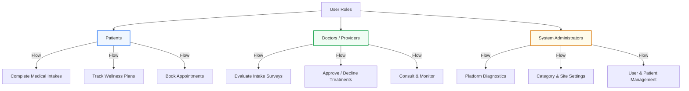

# 🩺 WEIGHTLOSSMD & Wellness Clinical Platform

A highly secure, performant, and modern patient intake, diagnostic assessment, and clinical workflow portal built on **Next.js 15+** and **Redux Toolkit**. 

This application operates as a unified front-end interface, designed to interact with a secure microservices backend architecture to support patients, medical providers, and system administrators.

---

## 👥 Targeted User Roles

The platform segregates workflows into three distinct roles, each tailored to specific access tiers and features:



### 1. 🩸 Patients (Intake & Wellness Suite)
* **Custom Intake Assessments:** Patients complete interactive, multi-stage clinical questionnaires (e.g., Weight Loss, Hormone Therapy, Regrow Hair, Skin Rejuvenation).
* **Remote Care Portal:** View prescribed treatments, track overall progress, and review clinical reports securely from home.
* **Scheduling & E-Commerce:** Book online appointments with specialized providers and purchase certified wellness products directly.

### 2. 🥼 Doctors / Providers (Clinical Review Portal)
* **Medical Intake Evaluations:** Read detailed patient diagnostic surveys and history logs.
* **Clinical Decision Workflows:** Approve, decline, or request follow-ups on specific treatment plans with advanced logging status indicators.
* **Patient Management:** Track ongoing diagnostic cases and schedule follow-ups.

### 3. 🛡️ System Administrators (Enterprise Dashboard)
* **Platform Diagnostics:** Monitor system-wide counts of total active patients, providers, and completed diagnostic surveys.
* **Content & Website Management:** Modify website pages, configure custom medical assessment categories, and update site settings.
* **User Lifecycle Management:** Oversee roles, permissions, and doctor approvals across the enterprise database.

---

## ⚡ Tech Stack & Architecture

This application utilizes a modern, enterprise-level architecture built to support high scalability and maintain absolute layout separation:

* **Framework:** **Next.js 15+** (App Router, Route Groups, React Server Components).
* **State Management & Caching:** **Redux Toolkit** & **RTK Query** (centralized API client layer, optimized base queries, cache validation).
* **Styling:** **Tailwind CSS + PostCSS** (highly responsive CSS-first visual systems, support for rich dark modes, transitions, and radial gradient glow elements).
* **Components:** Custom modular assemblies incorporating standard **Embla Carousel** horizontal slider interfaces and **Lucide React** vectors.
* **Type Safety:** Strict, shared interfaces consolidated in a central root `types` directory.

---

## 📂 Project Directory Structure

```bash
├── app/
│   ├── (dashboard)/        # Root Route Group for Admin & Provider portals
│   │   ├── admin/          # Stats overview dashboard & patient activity table
│   │   ├── layout.tsx      # Sidebar-header layout shell (Desktop & mobile responsive drawer)
│   │   └── Layout.tsx      # Multi-case proxy re-exporter
│   ├── (landingPage)/      # Root Route Group for Patients & Marketing views
│   │   ├── page.tsx        # Responsive medical core homepage
│   │   └── layout.tsx      # Clean full-width layout boundaries
│   ├── globals.css         # Tailwind directives & HSL colors
│   └── layout.tsx          # Root HTML frame & state providers
├── components/
│   ├── home/               # Domain components (AboutUs, Assesments, Expert, QNA, TestiMonial)
│   ├── shared/             # Globally shared elements (Navbar, Footer, Glassmorphic headers)
│   └── ui/                 # Reusable atomic buttons, cards, and spinners
├── Redux/
│   ├── api/                # RTK Query backend services mapping
│   ├── features/           # Dynamic slice states
│   └── store.ts            # Global Redux Store registry
└── types/                  # Global shared TypeScript contracts
```

---

## ⚙️ Getting Started

Follow these instructions to run the application in a local development environment:

### 1. Installation
Clone the repository and install all dependencies:
```bash
npm install
```

### 2. Configure Environment Variables
Create a `.env` or `.env.local` file in the root directory:
```env
NEXT_PUBLIC_API_GATEWAY_URL=http://localhost:5000/api
```

### 3. Start Development Server
Launch Next.js dynamic development server:
```bash
npm run dev
```
Open [http://localhost:3000](http://localhost:3000) in your browser to view the application.

### 4. Build for Production
Generate optimized, static-cache ready production builds:
```bash
npm run build
```
Verify the build compiles successfully and preview the bundle locally:
```bash
npm run start
```

---

## 🤝 Contribution Guidelines

This codebase is continuously upgraded to integrate clinical updates and compliance features. Please follow standard git branching conventions (`git switch -c feature/your-feature`) and ensure TypeScript static checks compile cleanly prior to raising any merge requests.

---

*WEIGHTLOSSMD & Wellness Clinical Platform - Built for Enterprise Scale.*
